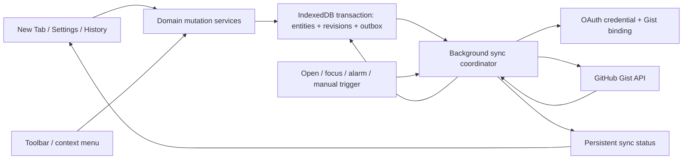

# GitHub OAuth Automatic Gist Sync Design

Date: 2026-07-12
Status: Implemented

## Context

Tabstow currently performs manual Gist synchronization with a pasted GitHub token, a manually configured Gist ID and filename, and separate Pull and Push buttons in both Settings and the New Tab. The version-one Sync File contains nested Tab Sessions, Quick Links, and selected settings, but its directional merge has no entity revisions or Deletion Markers. It cannot reliably propagate deletion, consumption, restore, or concurrent ordering changes, and it has no automatic scheduler.

This design replaces the pasted token with GitHub OAuth Device Flow, keeps the user's existing Gist, makes synchronization automatic and local-first, and upgrades Saved for Later and Quick Links to deterministic full-lifecycle synchronization.

## Goals

- Connect each device through GitHub OAuth Device Flow without a backend or client secret.
- Discover an existing Tabstow Gist when it is unambiguous; never create a Gist.
- Reconcile on New Tab use and batch local mutations behind a 60-second quiet period.
- Continue due background synchronization after the New Tab closes or the service worker restarts.
- Synchronize Saved for Later creation, editing, membership, ordering, movement, consumption, restore, and deletion.
- Give Quick Links the same add, edit, order, and deletion guarantees.
- Keep local operations available and durable when GitHub is unavailable.
- Keep Manual Pull and Manual Push in Settings as non-destructive recovery controls.
- Surface persistent, actionable unable-to-sync states in the New Tab.

## Non-goals

- Creating a Gist or changing an existing Gist's visibility.
- A hosted OAuth callback, token broker, webhook receiver, or other backend.
- Supporting pasted personal access tokens or legacy token configuration.
- Allowing old extension versions to continue writing after the Sync File becomes version two.
- Real-time push notifications or fixed-interval polling.
- Linearizable or transactionally atomic writes across devices.
- Force-local or force-remote replacement controls.
- Synchronizing History, Todos, theme, language, OAuth credentials, Gist binding, or uploaded Quick Link image bytes.
- Client-side encryption or a new cross-device passphrase.
- Deletion Marker expiry, compaction, device acknowledgements, or device-management UI.
- Content scripts, remote executable code, or broad non-GitHub host access.

## Product Decisions

The following decisions were confirmed during the design interview:

- Device Flow replaces the manual GitHub token completely.
- The maintainer registers the OAuth App, enables Device Flow, and supplies its public build-time client ID.
- Tabstow uses an existing Gist and never creates one.
- Automatic discovery uses the canonical `tabstow.sync.json` filename; custom filenames remain manually configurable.
- Initial connection non-destructively merges local and remote synchronized data.
- Existing local data requires confirmation before it is uploaded to an authorized account or a changed Gist binding.
- Entity conflicts use a logical counter and Replica ID tie-breaker, not wall-clock time.
- Tab Sessions, Saved Tabs, Quick Links, ordering, and Deletion Markers are independently versioned.
- Deletion Marker garbage collection is deferred.
- Local mutations are immediate and never wait for or roll back because of GitHub.
- New Tab open and focus perform event-driven reads; local writes are batched for 60 seconds.
- Every synchronization-relevant mutation entrypoint participates, including toolbar, context menu, History Restore, Quick Links, and Settings.
- Manual Pull and Manual Push are safe merge operations and live only in Settings.
- The New Tab displays persistent synchronization state and actionable failure messages.
- Version-one data is imported once, version two is written thereafter, and old clients are not supported.

## Recommended Decisions Applied Without Further Questions

- A non-empty invalid Sync File is never overwritten automatically or by Manual Push.
- Settings offers Open Gist, Retry, and Choose Another Gist for invalid remote content; no force-reset action is included.
- A manually selected, user-owned existing Gist may have a missing or truly empty Sync File initialized after confirmation. Discovery never creates a file.
- A public Gist is never auto-bound and requires an explicit warning before manual binding.
- OAuth requests only the `gist` scope, verifies that it was granted, and resolves the immutable numeric GitHub user ID through `/user` after every authorization.
- OAuth credentials live in a background-only credential store and never cross the ordinary Settings message boundary.
- Device Flow progress is persisted so background polling can continue if Settings closes, while respecting GitHub's returned interval and `slow_down` responses.
- Reauthorization preserves the Gist binding only when the same GitHub user returns; a different user restarts discovery and confirmation.
- Restore from local History creates fresh Session and Saved Tab identities. Existing Deletion Markers remain historical synchronization metadata.
- Concurrent normalized-URL duplicates converge to one deterministic winner and create Deletion Markers for the losing entities.
- Uploaded Quick Link image-only changes are local-only and do not schedule synchronization.
- Retry delays are `1m → 2m → 5m → 15m → 1h`, with jitter and GitHub `Retry-After` or rate-limit reset taking precedence.
- Parsed Sync Files are capped at 5 MiB and 50,000 combined entities and markers to prevent a malformed Gist from exhausting extension memory.
- The OAuth App limit of ten tokens per user/application/scope is documented; an older device whose token is revoked enters reconnect-required state.

## State Ownership

### Synchronized State

- Tab Session metadata and Saved Order.
- Saved Tabs, session membership, and Saved Order within a session.
- Quick Links and Quick Link order.
- `includePinnedTabs` and `closePinnedTabs`, each independently versioned.
- Deletion Markers and revision metadata.

### Device-local State

- OAuth access token and authorization attempt state.
- GitHub account identity and Gist binding.
- Locally owned Replica ID.
- Pending generation, retry schedule, and presentation status outside the Sync File.
- History, Todos, theme, and language.
- Uploaded Quick Link image bytes and their local cache tokens.

The Replica ID is locally owned and is never replaced by a remote setting. Its opaque value appears in revisions only so every device can resolve equal logical counters identically.

## Architecture



### Component responsibilities

- **OAuth client**: starts Device Flow, polls correctly, validates scope and GitHub user identity, and removes transient device codes after completion, cancellation, or expiry.
- **Connection store**: owns the background-only token, account ID/login, Gist binding, connection generation, and disconnect behavior.
- **Gist client**: lists paginated Gists, reads candidate files, reads one bound file, initializes an explicitly selected empty file, updates content, and classifies GitHub errors.
- **Sync repository**: stores version-two entities, Deletion Markers, Replica ID, logical revisions, positions, pending generation, and last applied remote state.
- **Sync coordinator**: serializes triggers, enforces quiet periods and cooldowns, merges data, performs retries, prevents stale tasks after disconnect, and broadcasts status/data changes.
- **New Tab UI**: renders local data immediately, triggers open/focus reads, refreshes after background data changes, and displays concise status without blocking local actions.
- **Settings UI**: owns OAuth, Gist discovery/selection, Connection Confirmation, detailed status, Manual Pull, Manual Push, Disconnect, and GitHub revocation links.

## Local Persistence and Atomicity

All version-two Synchronized State, revision metadata, Deletion Markers, and pending/outbox generation must be stored in IndexedDB. Each Sync-relevant Mutation writes domain state and increments the pending generation in the same Dexie transaction. This prevents the Manifest V3 service worker from terminating between a successful data write and a separate dirty-marker write.

OAuth credentials, Gist binding, non-authoritative UI status, and other Device-local State remain in extension storage. Uploaded Quick Link image bytes remain in Cache Storage. `getSettings` composes synchronized behavior preferences with device-local settings but never returns the OAuth token.

## OAuth Device Flow

1. Settings starts Device Flow with the public client ID and `gist` scope.
2. The response's device code, user code, verification URL, expiry, and polling interval are stored as a short-lived authorization attempt.
3. Settings displays the code with Copy, Open GitHub, and Cancel actions.
4. Polling respects the returned interval and handles `authorization_pending`, `slow_down`, `expired_token`, `access_denied`, and `device_flow_disabled` explicitly.
5. On success, Tabstow verifies the response includes `gist`, then calls `/user` and stores the numeric user ID and login with the token.
6. Gist discovery begins only after identity validation.
7. A successful connection removes the old `githubToken` field permanently; no compatibility path remains.

The pending Device Flow attempt survives a Settings close through persisted state and alarms. Closing or cancelling the attempt removes the short-lived code without affecting local user data.

GitHub documents both the Device Flow protocol and its polling requirements in [Authorizing OAuth apps](https://docs.github.com/en/apps/oauth-apps/building-oauth-apps/authorizing-oauth-apps). GitHub also limits a user/application/scope combination to ten active tokens, revoking the oldest when an eleventh is created; this bounds simultaneously authorized devices to roughly ten for this OAuth App.

## Gist Discovery and Binding

1. List the authenticated user's Gists across all pages.
2. Filter metadata to candidates containing `tabstow.sync.json`.
3. Read candidates sequentially and accept only valid version-one or version-two Tabstow documents owned by the authenticated numeric user ID.
4. Bind automatically only when exactly one valid non-public candidate exists.
5. With no candidate, let the user enter an owned Gist ID and filename.
6. With multiple candidates, present an explicit selector.
7. Before a public Gist is bound, warn that saved titles and URLs will be public and require confirmation.
8. If an explicitly selected existing Gist lacks the named file, allow initialization only after confirmation. Empty content or `{}` is also initializable. Non-empty invalid content is never overwritten.

Once established, the Gist binding never changes automatically. A later 404, missing file, owner mismatch, or lost access enters Synchronization Paused. Rediscovery occurs only after an explicit Settings action.

GitHub's authenticated Gist listing, read, and update operations are documented in the [Gist REST API](https://docs.github.com/en/rest/gists/gists).

## Sync File Version Two

The version-two document is normalized so each independently mutable item carries its own revision.

```ts
type Revision = {
  counter: number;
  replicaId: string;
};

type SyncDocumentV2 = {
  format: 'tabstow';
  schemaVersion: 2;
  exportedAt: string;
  sessions: Array<{
    id: string;
    title: string;
    createdAt: string;
    position: string;
    revision: Revision;
  }>;
  tabs: Array<{
    id: string;
    sessionId: string;
    url: string;
    title: string;
    favIconUrl?: string;
    pinned?: boolean;
    createdAt: string;
    position: string;
    revision: Revision;
  }>;
  quickLinks: Array<{
    id: string;
    url: string;
    label: string;
    icon: { kind: 'site'; value: null } | { kind: 'emoji'; value: string } | null;
    createdAt: string;
    position: string;
    revision: Revision;
  }>;
  preferences: {
    includePinnedTabs: { value: boolean; revision: Revision };
    closePinnedTabs: { value: boolean; revision: Revision };
  };
  deletions: Array<{
    entityType: 'session' | 'tab' | 'quickLink';
    entityId: string;
    deletedAt: string;
    revision: Revision;
  }>;
};
```

`exportedAt` and `deletedAt` are diagnostic/display timestamps only. They never decide conflicts. `sourceWindowId`, Gist configuration, credentials, and device-local preferences are not serialized.

## Revision and Merge Rules

- Revisions compare `counter` first and Replica ID lexicographically second.
- A local mutation increments the winning revision counter for that entity inside the same transaction as the mutation.
- Active entities and Deletion Markers compete by the same revision comparison.
- A newer active entity may supersede an older marker, but History Restore uses new identities rather than relying on resurrection.
- Merging is deterministic, idempotent, and order-independent for a fixed set of versions.
- A Session deletion creates markers for the Session and all locally known child tabs. Tabs whose winning parent Session is deleted are suppressed, and reconciliation creates markers for orphaned stale children.
- Tab markers are resolved before the parent Session marker. If a concurrently moved or newly created Tab survives and still targets that Session, it preserves the parent instead of being discarded as an orphan; unchanged stale children still lose to their Tab markers.
- Moving a Saved Tab changes that tab's membership, position, and revision. If its old Session becomes empty, that Session receives a Deletion Marker.
- Saved Session, Saved Tab, and Quick Link order use lexicographically sortable fractional position strings. A move updates only the moved entity; equal positions use entity ID as a stable final tie-breaker.
- After entity merge, normalized Saved Tab URLs remain globally unique. The winner is chosen by revision, then stable creation/ID tie-breakers; losing entities receive deterministic Deletion Markers rather than being silently filtered.
- Quick Link uploaded image tokens never enter the Sync File. A remote field update preserves an existing local image override, while a winning link deletion removes the local cached image.

## Gist Concurrency and Eventual Convergence

GitHub does not document conditional PATCH support for Gist updates, so two devices can read the same revision and race their writes. Tabstow therefore promises Eventual Convergence, not linear consistency.

Every write-capable reconciliation performs:

1. Read and validate the latest bound Sync File.
2. Merge it with the complete local replica.
3. Apply the converged state locally.
4. Skip PATCH when the canonical remote bytes already match.
5. PATCH the canonical version-two document when needed.
6. Read back and verify that the written entity versions remain present.
7. Retry with jitter if another writer wins the race.

Local replicas retain active revisions and Deletion Markers, so a later reconciliation can reintroduce a temporarily overwritten winning version. GitHub notes that unsafe conditional requests are unsupported unless an endpoint explicitly documents them in its [REST API best practices](https://docs.github.com/en/rest/using-the-rest-api/best-practices-for-using-the-rest-api).

## Version-One Migration

- Discovery accepts a valid version-one file as a candidate.
- Migration reads Saved for Later, Quick Links, `includePinnedTabs`, and `closePinnedTabs` only.
- It ignores version-one `deviceId`, `gistId`, `gistFileName`, credentials, and excluded settings.
- Existing Session `sortOrder` and array order become fractional positions.
- Version-one same-ID Session conflicts use `updatedAt`, then stable ID ordering, only during migration.
- Existing global normalized-URL deduplication is applied before assigning initial revisions.
- Imported entities receive baseline version-two revisions under the local Replica ID.
- After Connection Confirmation and successful initial reconciliation, only schema version two is written.
- Old clients must reject version two and never overwrite it.

## Automatic Synchronization

### Read triggers

- New Tab first opens.
- An existing New Tab becomes visible or focused after a shared 60-second read cooldown.
- Manual Pull.
- An overdue retry or explicit Retry action.

Read triggers merge remote state locally and notify every open New Tab to reload Sessions and Quick Links. They do not advance or bypass an unexpired local quiet-period write deadline.

### Write triggers

- Every successful Sync-relevant Mutation increments the pending generation and replaces one named alarm for 60 seconds after the latest mutation.
- The alarm fires even after the originating New Tab closes; a sleeping device catches up after waking.
- Browser or worker startup recreates a missing alarm from persisted due time.
- Manual Push requests an immediate write-capable reconciliation.
- If pending work is already overdue when another trigger arrives, the coordinator may reconcile immediately.

### Serialization

- One persisted coordinator owns every trigger across all New Tabs and extension entrypoints.
- Only one network reconciliation runs at a time.
- A mutation during an in-flight run increments the generation; the run clears Pending Synchronization only when the generation it captured is still current and remote verification succeeded.
- A queued rerun executes after the active run when required.

### Retry and pause

- Network failures, 5xx responses, and rate limits retry with jittered `1m → 2m → 5m → 15m → 1h` delays.
- `Retry-After` and rate-limit reset headers override local backoff.
- 401 or missing `gist` scope pauses for reconnect.
- 404, owner mismatch, or missing bound file pauses for rebinding.
- Invalid non-empty JSON or schema pauses without overwrite.
- A stale persisted `syncing` state after worker restart becomes pending or retrying, never permanently stuck.

## Manual Synchronization

- **Manual Pull** reads, validates, and merges into local state without writing remotely. If local winning versions are absent remotely, Pending Synchronization remains.
- **Manual Push** reads the latest remote file, merges, writes only the converged result, and performs read-back verification.
- Neither action is available on the New Tab.
- Neither action bypasses schema validation, revisions, Deletion Markers, or Gist binding safety.

## Disconnect and Reauthorization

- Disconnect invalidates the current connection generation so queued work cannot start with stale credentials.
- It clears alarms, waits for any already-sent request to settle, deletes local OAuth/account/binding state, and preserves all local user data.
- An already-sent PATCH cannot be withdrawn.
- The remote Gist is never changed as part of Disconnect.
- Settings links to GitHub's authorized-app page because programmatic OAuth token revocation requires the client secret that Tabstow deliberately does not possess.
- Reauthorization to the same numeric GitHub account may retain a still-valid binding; a different account restarts discovery and Connection Confirmation.

## User Interface

### New Tab

- Remove Pull and Push from Saved for Later.
- Render local data immediately; synchronization never controls the existing local-action busy state.
- Show one compact persistent state: Not connected, Synced, Pending, Syncing, Retrying, or Paused.
- Pending and transient offline states say that changes are saved locally.
- Paused states show a persistent banner with Reconnect or Open Settings.
- Successful background merges broadcast a data-changed event so Sessions and Quick Links refresh without a page reload.
- Use existing New Tab localization for all new status copy.

### Settings

- Replace the token field with Connect GitHub.
- Show Device Flow code, expiry, Copy, Open GitHub, and Cancel.
- Show the connected GitHub login, Gist binding, visibility warning, and discovery/manual-selection states.
- Show Connection Confirmation with local Saved Tab and Quick Link counts.
- Show last successful synchronization time, detailed error, Retry, Manual Pull, Manual Push, and Disconnect.
- For invalid remote content, show Open Gist and Choose Another Gist; do not offer force overwrite.
- Link to the GitHub authorization page for full revocation.

## Manifest and Security

- Add `alarms` permission.
- Add the minimal static GitHub host permission needed for Device Flow endpoints under `https://github.com/*`; retain `https://api.github.com/*` and `https://gist.githubusercontent.com/*`.
- Do not add Chrome `identity`, content scripts, remote scripts, eval, or CDN assets.
- Keep the OAuth token out of `ExtensionSettings`, runtime status payloads, logs, errors, tests, and the Sync File.
- Restrict extension local storage to trusted extension contexts where supported.
- Treat the local Chrome profile as the credential security boundary; persistent Device Flow tokens cannot live only in session storage.
- Request only `gist` scope and validate it after authorization.
- Warn before binding a public Gist. Secret Gists remain unencrypted and are not truly private, so help text must not describe them as private.
- Reject oversized, excessive-entity, or deeply invalid documents before materializing them.

## Error Presentation

| Condition | Coordinator state | New Tab | Settings action |
| --- | --- | --- | --- |
| Offline / network / 5xx | Retrying | Changes saved locally; retry scheduled | Retry now |
| Rate limited | Retrying | Retry time | Respect GitHub reset |
| Token invalid / missing scope | Paused | Reconnect GitHub | Reconnect |
| Bound Gist or file missing | Paused | Sync target unavailable | Rescan or configure |
| Public Gist candidate | Needs confirmation | Not connected | Confirm visibility |
| Multiple valid candidates | Needs target | Not connected | Choose Gist |
| Invalid non-empty JSON/schema | Paused | Sync file needs attention | Open Gist / Retry / choose another |
| Device Flow denied/expired | Disconnected | Not connected | Start again |

No error path includes token text or the complete remote document in user-facing copy or logs.

## Expected Code Boundaries

### Core

- `packages/core/src/schemas.ts`
- `packages/core/src/sync-document.ts`
- `packages/core/src/tab-session.ts`
- `packages/core/src/index.ts`

These own version-two schemas, version-one import, revision comparison, deterministic entity merge, positions, Deletion Markers, and URL deduplication.

### Extension data and synchronization

- `apps/extension/src/db/db.ts`
- `apps/extension/src/features/tabs/session-service.ts`
- `apps/extension/src/features/quick-links/*`
- `apps/extension/src/features/settings/settings-storage.ts`
- `apps/extension/src/features/sync/gist-client.ts`
- `apps/extension/src/features/sync/sync-service.ts`
- New focused modules for OAuth Device Flow, connection credentials, IndexedDB sync repository, coordinator, alarms/retry, and status.

### Runtime and UI

- `apps/extension/src/entrypoints/background.ts`
- `apps/extension/src/lib/messages.ts`
- `apps/extension/src/lib/errors.ts`
- `apps/extension/wxt.config.ts`
- `apps/extension/src/entrypoints/options/OptionsApp.tsx`
- `apps/extension/src/entrypoints/newtab/App.tsx`
- `apps/extension/src/entrypoints/newtab/components/StowedSessions.tsx`
- A focused New Tab sync-status component and localized strings/styles.

### Documentation

- Update `README.md`, `docs/gist-sync.md`, and `docs/manual-qa.md` only when implementation lands, so current user documentation continues to describe the currently shipped behavior until then.

## Test Strategy

### Core convergence tests

- Parse valid version two and reject duplicates, malformed revisions, secrets, excessive sizes, and unsupported versions.
- Import version one once and preserve Sessions, Quick Links, behavior settings, and order.
- Prove deterministic, idempotent merge for different entities, same-entity counters, Replica ID ties, active-versus-deletion conflicts, and revived newer active entities.
- Cover concurrent moves, cross-session moves, empty-session deletion, equal positions, orphaned children, and deterministic normalized-URL deduplication with Deletion Markers.
- Cover Quick Link lifecycle and independent behavior-preference revisions.

### OAuth and Gist tests

- Device Flow success, pending, `slow_down`, denial, expiry, cancellation, and disabled flow.
- Token never crosses Settings/runtime/sync boundaries.
- Account identity and `gist` scope validation.
- Gist discovery across pagination with zero, one, multiple, public, v1, v2, invalid, foreign-owned, custom-name, missing-file, and empty-file cases.
- No endpoint ever creates a Gist or silently changes a binding.

### Coordinator tests

- Every successful mutation atomically increments pending generation and resets one 60-second alarm.
- A burst of mutations produces one PATCH.
- New Tab closure, worker restart, browser startup, and device wake preserve pending work.
- Multiple New Tabs, alarms, and manual actions serialize.
- Open/focus observes cooldown and does not push before an active quiet-period deadline.
- Mutation during sync remains pending.
- Unchanged canonical content skips PATCH.
- PATCH verification detects a competing writer and retries.
- Backoff, GitHub reset headers, pause classifications, reconnect, rebinding, and Disconnect generation invalidation.
- Background merge refreshes open New Tabs.

### UI tests

- New Tab has no Pull/Push and renders every status/action without disabling local work.
- Settings covers Device Flow, discovery, confirmation, binding, public warning, Manual Pull/Push, invalid-file recovery, last-success, and Disconnect.
- Remote deletion does not create local History.
- Local primary open/delete/restore-all creates History plus synchronization deletions as appropriate.
- Middle-click open and History open/permanent delete remain device-local and do not schedule synchronization.
- History Restore creates fresh synchronized identities.
- Uploaded Quick Link image behavior stays local.
- Manifest tests assert the exact minimal permissions and hosts.

## Verification

Automated gates:

```bash
bun run test
bun run typecheck
bun run build
```

Manual two-profile QA:

- Connect both profiles through Device Flow to one existing Gist.
- Exercise automatic discovery, manual target selection, public warning, and Connection Confirmation.
- Verify open/focus reads and a burst of local changes yields one delayed push.
- Close the New Tab before the deadline and confirm the alarm still completes.
- Test offline mutation, restart, retry, reconnect, and binding loss.
- Concurrently add, edit, move, consume, restore, and delete different and identical Saved Tabs.
- Concurrently add, edit, reorder, and delete Quick Links.
- Confirm equal final state on both profiles and no remote deletion creates History.
- Corrupt the Sync File and confirm Tabstow pauses without overwriting it.
- Upgrade a version-one file and confirm only version two is subsequently written.

## Risks and Explicit Limits

- Gist PATCH has no atomic compare-and-swap, so convergence may require a later successful reconciliation after a race.
- OAuth App token count limits can force the oldest of more than ten connected devices to reconnect.
- Secret Gists are unlisted, not encrypted or truly private; Tabstow does not alter visibility.
- Deletion Markers grow indefinitely in this version.
- Chrome alarms may run later than requested, especially after sleep, but persisted pending work prevents loss.
- Gist discovery cost grows with the user's Gist count and must honor pagination and rate limits.
- Moving synchronized Quick Links/preferences into an atomic IndexedDB-backed repository increases migration scope but closes a real lost-dirty-write window.

## External Prerequisite

The maintainer will register the GitHub OAuth App, enable Device Flow, and provide the public client ID through build configuration. No client secret is required or accepted by the extension.
